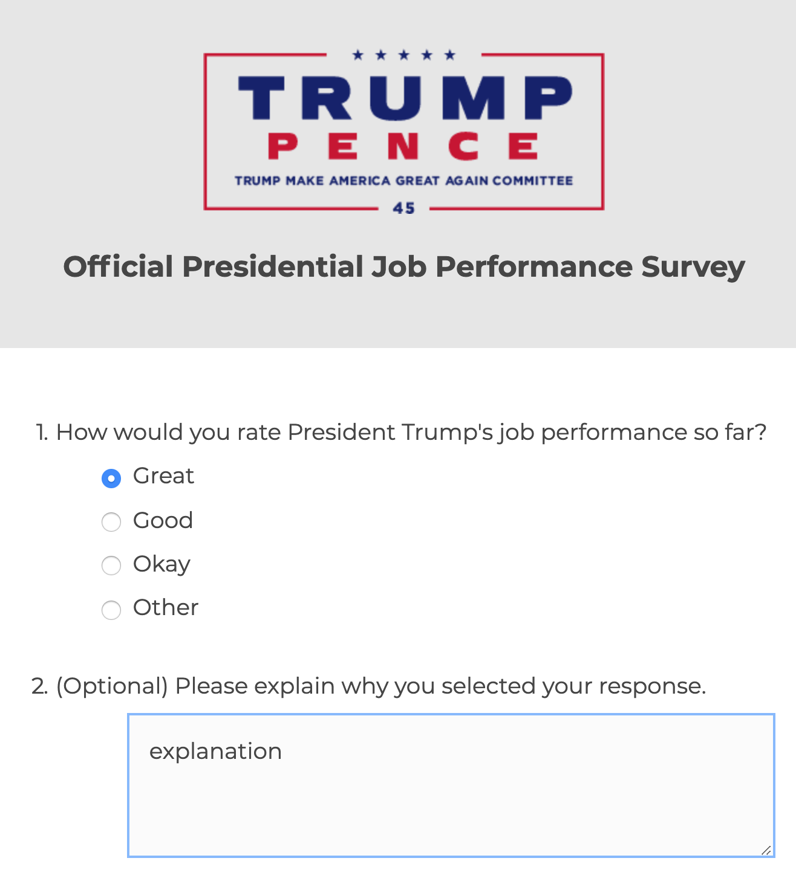
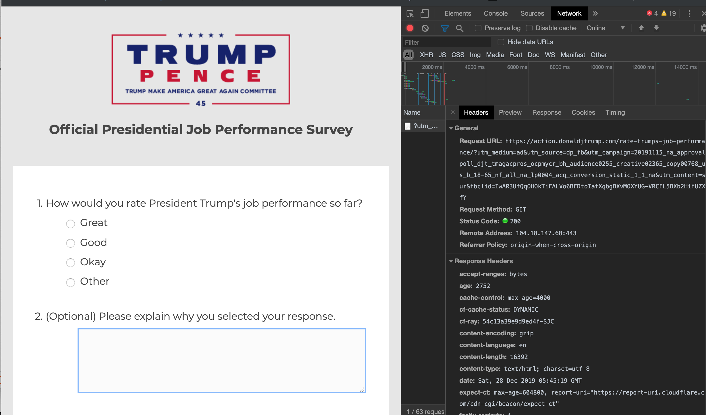
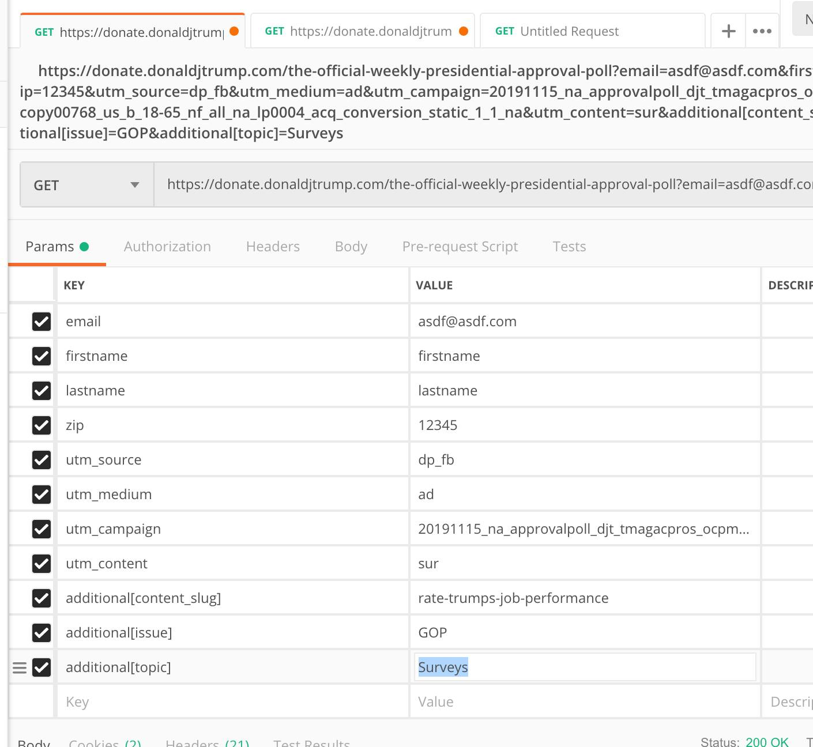

# fuck-trump-demographics
Trump collects demo information disguised as a poll.  This proudly helps fuck it up.

A bit of a hollow victory, but fuck Trump.

## Usage

```bash
python send-data.py
```

## Background
On Facebook, there are several targeted ads boasting to be the 'Official Trump Poll'.  It is comprised of two questions.



The source shows that a GET request is sent instead of a POST after 'SUBMIT'-ing.



Only Name, Email, and Zip Code is collected as query parameters, demographic information.



So we just send more shit.

```json
{
   "utm_campaign": "20191115_na_approvalpoll_djt_tmagacpros_ocpmycr_bh_audience0255_creative02365_copy00768_us_b_18-65_nf_all_na_lp0004_acq_conversion_static_1_1_na", 
   "zip": 53775, 
   "firstname": "Magnus", 
   "utm_content": "sur", 
   "additional[issue]": "GOP", 
   "utm_source": "dp_fb", 
   "utm_medium": "ad", 
   "lastname": "Christensen", 
   "additional[topic]": "Surveys", 
   "additional[content_slug]": "rate-trumps-job-performance", 
   "email": "Magnus_Christensen@hotmail.com"
}
```